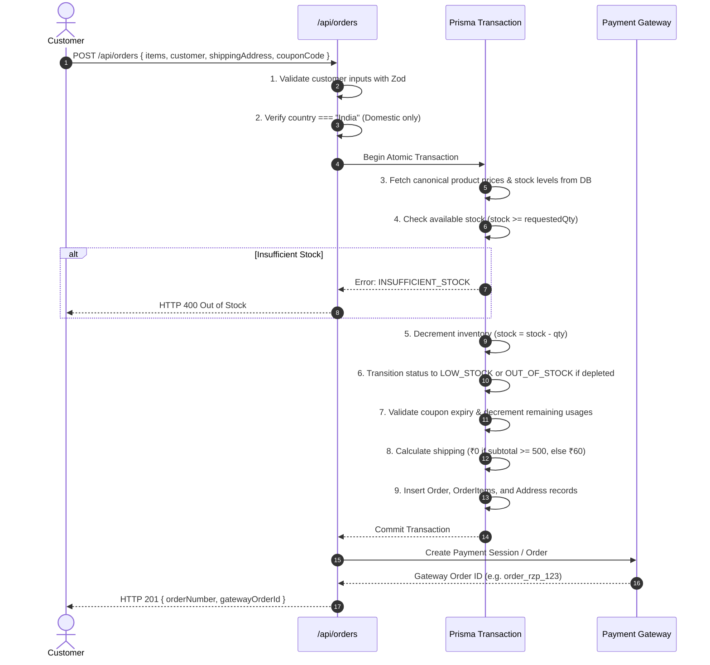

# Claypresso — System Architecture & Technical Design

## 1. High-Level System Architecture

Claypresso is architected as a modern, unified Next.js 15 application utilizing the App Router. The client components deliver a tactile, physics-driven UI, while the server components and route handlers provide secure, transactional business logic directly connected to Prisma ORM.

```
┌─────────────────────────────────────────────────────────────────────────┐
│                           CLIENT BROWSER                                │
│                                                                         │
│  ┌───────────────────────┐  ┌─────────────────┐  ┌──────────────────┐   │
│  │   Tactile Clay UI     │  │  Custom Cursor  │  │   Cart & State   │   │
│  │  (Claymorphism/Bento) │  │  (RAF / Physics)│  │   (Local Storage)│   │
│  └───────────┬───────────┘  └────────┬────────┘  └────────┬─────────┘   │
└──────────────┼───────────────────────┼────────────────────┼─────────────┘
               │                       │                    │
               ▼                       ▼                    ▼
┌─────────────────────────────────────────────────────────────────────────┐
│                     NEXT.JS 15 APPLICATION LAYER                        │
│                                                                         │
│  ┌───────────────────────────────────────────────────────────────────┐  │
│  │                      Edge / Node Middleware                       │  │
│  │     (Security Headers, CORS Isolation, Rate Limiting, RBAC)       │  │
│  └─────────────────────────────────┬─────────────────────────────────┘  │
│                                    │                                    │
│        ┌───────────────────────────┴──────────────────────────┐         │
│        ▼                                                      ▼         │
│  ┌──────────────────────────┐                   ┌────────────────────┐  │
│  │ Server Components (RSC)  │                   │ Route Handlers     │  │
│  │ (Catalog, Static Pages,  │                   │ (/api/orders, auth,│  │
│  │  SEO, Dynamic Metadata)  │                   │  admin, payments)  │  │
│  └─────────────┬────────────┘                   └──────────┬─────────┘  │
└────────────────┼───────────────────────────────────────────┼────────────┘
                 │                                           │
                 ▼                                           ▼
┌─────────────────────────────────────────────────────────────────────────┐
│                     BACKEND SERVICES & INTEGRATIONS                     │
│                                                                         │
│  ┌───────────────────┐  ┌──────────────────┐  ┌──────────────────────┐  │
│  │  Prisma Database  │  │ Payment Gateways │  │ Courier Tracking     │  │
│  │ (SQLite / Postgres│  │(Razorpay / Stripe│  │ (India Post / DTDC)  │  │
│  │  with Tx Locks)   │  │ Webhook Handles) │  │ URL Generation       │  │
│  └───────────────────┘  └──────────────────┘  └──────────────────────┘  │
│                                                                         │
│  ┌───────────────────┐  ┌──────────────────┐  ┌──────────────────────┐  │
│  │ File Storage      │  │ Email Dispatcher │  │ Image Pipeline       │  │
│  │ (Magic Bytes Anti-│  │ (Resend / SMTP / │  │ (Sharp Resizing &    │  │
│  │  Exploit Sandbox) │  │  Console Mock)   │  │  WebP Compression)   │  │
│  └───────────────────┘  └──────────────────┘  └──────────────────────┘  │
└─────────────────────────────────────────────────────────────────────────┘
```

---

## 2. Client-Side Motion & Interaction Architecture

To maintain 60 FPS performance without memory leaks or layout thrashing, Claypresso implements a centralized interaction tree:

```
                  ┌──────────────────────┐
                  │   Window Pointer     │
                  └──────────┬───────────┘
                             │ (Single event listener)
                             ▼
                  ┌──────────────────────┐
                  │    MouseProvider     │ (Computes normX, normY, velocity, speed)
                  └──────────┬───────────┘
         ┌───────────────────┼─────────────────────┐
         ▼                   ▼                     ▼
┌──────────────────┐ ┌────────────────┐ ┌────────────────────┐
│   CustomCursor   │ │ Magnetic.tsx   │ │ TiltCard.tsx       │
│ (Soft center dot,│ │ (8-14px spring │ │ (2-4° perspective  │
│  spring lag ring,│ │  CTA pull with │ │  tilt, card shadow │
│  micro-trail)    │ │  travel arrow) │ │  displacement)     │
└──────────────────┘ └────────────────┘ └────────────────────┘
```

### Safety & Degradation Guards
- **Coarse Pointer Detection**: Automatically shuts off custom cursor, cursor trail, and magnetic behavior on mobile and tablet touch devices (`@media (pointer: coarse)` and touch events).
- **Reduced Motion Support**: Strictly honors `prefers-reduced-motion: reduce`, skipping parallax, 3D tilt, and dynamic transformations.
- **Click Safety**: Cursor overlays use `pointer-events: none !important;` with `z-index: 999999` to guarantee clicks, touches, and input focus are never blocked.

---

## 3. Order Processing & Transaction Flow

Order creation is executed as an **atomic, all-or-nothing database transaction** to prevent inventory discrepancies and invalid price tampering.



---

## 4. Payment Gateway & Webhook Idempotency

Claypresso integrates with **Razorpay** and **Stripe** using a zero-trust verification model:

1. **Session Creation**:
   - `/api/payments/create-session` validates that the order exists, is in `PENDING` payment state, and calculates the exact amount from the database.
2. **Client Verification Handler**:
   - `/api/payments/verify` validates the cryptographic HMAC signature (`crypto.createHmac('sha256', secret)`) using the gateway's public signature algorithm.
   - If valid, the order status transitions to `PROCESSING` and payment status to `PAID`.
3. **Webhook Replay Prevention**:
   - `/api/payments/webhook` listens for asynchronous capture events.
   - Incoming event IDs (`event_id`) are recorded in an idempotency table or order notes.
   - Duplicate delivery of the same webhook payload is identified and acknowledged with `{ processed: true, duplicate: true }` without executing duplicate database adjustments.

---

## 5. File Upload & Magic-Byte Sandbox Architecture

User reference uploads for custom creations (`/custom/request`) are secured against malicious file uploads (e.g., shell scripts disguised with `.png` extensions):

```
Uploaded File Buffer
         │
         ▼
[Size Check (< 10MB)] ──── Fail ───► HTTP 400 File too large
         │
         ▼
[Magic Byte Inspection]
  - JPEG: FF D8 FF
  - PNG:  89 50 4E 47 0D 0A 1A 0A
  - WebP: 52 49 46 46 .... 57 45 42 50
         │
         ├── Fail ───► HTTP 400 Corrupted or forged file format
         ▼
[Sharp Processing] (Strip EXIF metadata, re-encode to WebP)
         │
         ▼
[Save to Sandboxed Folder] (`/public/uploads/custom/...`)
```

---

## 6. Authentication & Authorization Model

- **Customer vs. Admin Roles**:
  - `CUSTOMER`: Can view own order history, track shipments, submit custom requests, write reviews, and manage wishlist items.
  - `ADMIN`: Has full access to `/admin`, can adjust stock levels, fulfill orders, configure coupons, and moderate community reviews.
- **Stateless Tokens (`jose` JWT)**:
  - Tokens are signed with `HS256` using `JWT_SECRET`.
  - Transmitted via **HTTP-only, Secure, SameSite=Lax** cookies (`claypresso_token`).
  - Middleware enforces path-based access control, redirecting unauthorized users attempting to access `/admin/*` to `/account/login`.
