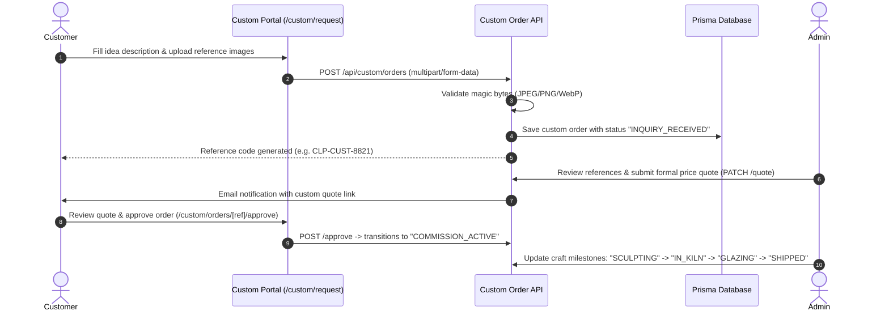

# Claypresso — Handmade Polymer Clay Atelier & E-Commerce Platform

> **"Little things. Big personality."**  
> An independent polymer clay accessories studio in Bangalore, India crafting small-batch bag charms, keychains, mini phone straps, trays, and bespoke custom gifts.

[](https://nextjs.org/)
[](https://react.dev/)
[](https://www.prisma.io/)
[](https://www.typescriptlang.org/)
[](LICENSE.md)

---

## Table of Contents

- [Overview](#overview)
- [Design Aesthetics & Visual Language](#design-aesthetics--visual-language)
- [Key Features](#key-features)
- [Tech Stack](#tech-stack)
- [Architecture & Directory Structure](#architecture--directory-structure)
- [Getting Started](#getting-started)
  - [Prerequisites](#prerequisites)
  - [Installation](#installation)
  - [Database Setup & Seeding](#database-setup--seeding)
  - [Running the Development Server](#running-the-development-server)
  - [Production Build](#production-build)
- [Environment Variables](#environment-variables)
- [E-Commerce & Business Rules](#e-commerce--business-rules)
- [Custom Creation Atelier Flow](#custom-creation-atelier-flow)
- [Admin Operations](#admin-operations)
- [Security & Anti-Exploit Measures](#security--anti-exploit-measures)
- [Documentation Index](#documentation-index)
- [License](#license)

---

## Overview

Claypresso is an end-to-end e-commerce platform and bespoke commission workflow built specifically for an artisanal polymer clay studio based in Bangalore, India. 

Unlike generic e-commerce templates, Claypresso blends:
- **Tactile Claymorphic Visuals**: Beveled 3D clay surfaces, soft dual-inner/outer drop shadows, squishy press animations, and authentic washi-tape clips.
- **Physical Mouse Physics**: Inertial cursor follower with particle trail, magnetic buttons, 3D card tilt with cursor-following artwork, and hero depth parallax.
- **Robust Production Backend**: Full atomic order processing, server-enforced concurrency and stock oversell protection, real Razorpay and Stripe payment gateway sessions with idempotent webhooks, and India-specific courier tracking (India Post / DTDC).
- **Interactive Bespoke Atelier**: Dedicated `/custom` commission engine allowing customers to upload design references, configure clay preferences, and track custom approvals.

---

## Design Aesthetics & Visual Language

Claypresso's design fuses modern editorial design with physical handmade warmth:

- **Claymorphism**: Multi-layered inset highlights and soft drop shadows (`--shadow-clay-card`, `--shadow-clay-pill`, `--shadow-clay-pressed`) simulating hand-kneaded polymer clay.
- **Scrapbook & Postal Stationery**: Artisanal washi tape clips (`.washi-tape`), postmark rubber stamps (`.stamp-seal`), polaroid photo cards (`.polaroid-frame`), and paper grain texture overlay.
- **Bento Grid Layout**: Asymmetric modular grid arrangements across category discoveries, product spotlights, and atelier stories.
- **Swiss & Luxury Typography**: High-contrast serif headlines (`Fraunces`) paired with utilitarian clean sans-serif body copy (`DM Sans`).
- **Neo-Brutalist / Y2K Micro-Accents**: High-contrast sticker badges (`.sticker-badge`) with hard offset drop shadows (`2px 2px 0 var(--color-espresso)`).
- **Restrained Pointer Physics**: Spring-interpolated magnetic CTA buttons, 2–3.2° perspective tilt on cards, and 6px depth lens on product photography.

---

## Key Features

### Customer Experience
- **Editorial Scrapbook Homepage**: Dynamic bento grid showcasing bestsellers, new arrivals, category discovery, studio process polaroids, and bespoke custom order callout.
- **Shop & Catalog Filtering**: Filter by category (`charms`, `keychains`, `mini-phone-charms`, `magnets`, `trays`, `badges`, `hair-pins`), price ranges, and status.
- **Tactile Product Detail Page**: High-resolution gallery with cursor-responsive depth lens, variant selection, stock urgency alerts, and accordion care guides.
- **Slide-Out Cart Drawer & Floating Cart**: Real-time quantity adjustment, free-shipping threshold progress tracker (Free shipping at ₹500+), and fly-to-cart animation.
- **Full Checkout**: Streamlined checkout with India-only state/pincode validation, coupon discount redemption, and multi-gateway payment (UPI, Cards, NetBanking, COD).
- **Public Order Tracking (`/track-order`)**: Real-time timeline (Received → In Kiln / Sculpting → Cured & Glazed → Packed → Dispatched) with courier tracking links.
- **Customer Account (`/account`)**: Optional login/registration, order history, tracking details, and saved wishlist.

### Bespoke Custom Creation (`/custom`)
- Interactive multi-step commission form (`/custom/request`).
- Multi-file image upload with client-side preview and server-side magic byte anti-exploit validation.
- Custom pricing quote workflow with admin negotiation and customer approval links.

### Admin Operations (`/admin`)
- Operations dashboard: Revenue metrics, order breakdown, custom request queue, and inventory alerts.
- Product catalog manager: Add/edit products, manage multiple images, variants, collections, and stock adjustments.
- Order fulfillment: Update statuses (`PENDING`, `PROCESSING`, `SHIPPED`, `DELIVERED`, `CANCELLED`), assign courier (India Post / DTDC), and input tracking numbers.
- Discount engine: Create percentage or fixed rupee discount codes with expiration dates and usage limits.
- Review moderation: Approve or reject submitted customer reviews before they appear publicly.

---

## Tech Stack

| Layer | Technology |
|---|---|
| **Framework** | Next.js 15 (App Router, Server Components & Route Handlers) |
| **UI Library** | React 19 |
| **Styling** | Vanilla CSS Modules + Design Token System (`tokens.css`, `globals.css`) |
| **Icons** | Lucide React |
| **Database ORM** | Prisma 6.19 (SQLite default for zero-config local dev, PostgreSQL ready) |
| **Authentication** | Jose JWT (`HS256`), HTTP-only Secure Cookies, `bcryptjs` password hashing |
| **Payments** | Razorpay Node SDK & Stripe SDK integration with webhook idempotency |
| **Validation** | Zod 4 schema validation |
| **Language** | TypeScript 5 (Strict Mode) |

---

## Architecture & Directory Structure

```
Claypresso/
├── prisma/
│   ├── schema.prisma          # Complete relational database models
│   ├── seed.ts                # Database seeder (products, admin user, coupons)
│   └── dev.db                 # Local SQLite database file
├── public/
│   └── images/                # Static studio assets, product photography, logos
├── src/
│   ├── app/                   # Next.js App Router (pages & API route handlers)
│   │   ├── (customer routes)  # /, /shop, /product/[slug], /cart, /checkout
│   │   ├── custom/            # Bespoke request workflow (/custom, /custom/request)
│   │   ├── account/           # Customer auth & order history
│   │   ├── admin/             # Admin management dashboard & operations
│   │   ├── api/               # RESTful API route handlers (Auth, Orders, Admin, etc.)
│   │   ├── layout.tsx         # Root layout with fonts, providers, header & footer
│   │   └── page.tsx           # Editorial Scrapbook Bento Homepage
│   ├── components/            # Reusable UI component library
│   │   ├── common/            # Header, Footer, CartDrawer, CustomCursor, Motion
│   │   ├── product/           # ProductCard, ProductDetail, ProductGrid
│   │   ├── shop/              # CatalogFilters, CategoryBanners
│   │   └── ui/                # Button, Badge, Input, Select, Modal, ScrollReveal
│   ├── context/               # Global React contexts (Cart, Wishlist, MouseContext)
│   ├── data/                  # Static catalogue definitions & fallback data
│   ├── lib/                   # Shared backend utilities (auth, db, shipping, rateLimit)
│   ├── styles/                # Global styling & CSS variables
│   │   ├── tokens.css         # Claymorphic shadows, colors, typography tokens
│   │   └── globals.css        # Base reset, washi-tape, polaroid, stamp classes
│   └── types/                 # TypeScript interfaces and domain schemas
├── docs/                      # Technical documentation
│   ├── API.md                 # REST API reference
│   ├── ARCHITECTURE.md        # Deep-dive architecture & data flows
│   ├── DATABASE.md            # Database schema & ER diagram
│   ├── DESIGN_SYSTEM.md       # Visual tokens & aesthetic specifications
│   └── TESTING.md             # QA test suite & verification guide
├── CONTRIBUTING.md            # Contribution guidelines
├── DEPLOYMENT.md              # Production deployment guide
├── SECURITY.md                # Security policy & disclosure
└── package.json               # Dependencies and scripts
```

---

## Getting Started

### Prerequisites
- **Node.js**: v18.18.0 or higher (v20+ recommended)
- **npm**: v9+ or yarn/pnpm

### Installation
Clone the repository and install dependencies:

```bash
git clone https://github.com/your-username/claypresso.git
cd claypresso
npm install
```

### Database Setup & Seeding
Claypresso uses Prisma. Initialize the database and seed it with catalogue products, categories, sample custom orders, and the default admin account:

```bash
# Push schema to local SQLite database
npm run db:push

# Seed products, categories, and admin credentials
npm run db:seed
```

> **Default Admin Account (from seed):**  
> **Email:** `admin@claypresso.com`  
> **Password:** `AdminPassword123!`

### Running the Development Server
```bash
npm run dev
```
Open [http://localhost:3000](http://localhost:3000) in your browser.

### Production Build
```bash
# Type-check and build optimized bundle
npm run build

# Start production server
npm run start
```

---

## Environment Variables

Copy `.env.example` to `.env` and adjust the variables for your environment:

```env
# Database
DATABASE_URL="file:./prisma/dev.db"

# JWT & Authentication
JWT_SECRET="super-secret-jwt-key-min-32-chars-long"

# Application URL
NEXT_PUBLIC_APP_URL="http://localhost:3000"

# Payment Gateways (Optional for simulation, required for live)
RAZORPAY_KEY_ID="rzp_test_..."
RAZORPAY_KEY_SECRET="your_razorpay_secret"
RAZORPAY_WEBHOOK_SECRET="your_webhook_secret"

STRIPE_SECRET_KEY="sk_test_..."
STRIPE_WEBHOOK_SECRET="whsec_..."

# Email / Notifications (Optional, falls back to console logger)
SMTP_HOST="smtp.resend.com"
SMTP_PORT="587"
SMTP_USER="resend"
SMTP_PASS="re_..."
EMAIL_FROM="orders@claypresso.com"
ADMIN_EMAIL="admin@claypresso.com"
```

---

## E-Commerce & Business Rules

1. **Domestic India-Only Shipping**: Claypresso only ships within the Republic of India. Orders with foreign destinations are rejected by server-side validation with `UNSUPPORTED_COUNTRY`.
2. **Pricing Structure**: All items priced in Indian Rupees (INR `₹`), typically ranging from ₹80 (pins/charms) to ₹1,200 (intricate bespoke trays/sculptures).
3. **Shipping Tiers**:
   - Cart subtotal < ₹500: Flat shipping fee of **₹60**.
   - Cart subtotal ≥ ₹500: **Free Shipping** applied automatically.
4. **Production Types**:
   - `READY_MADE`: Dispatched within 24–48 hours.
   - `MADE_TO_ORDER`: Hand-sculpted upon order (~7–10 days).
   - `CUSTOM`: Bespoke commission workflow (~25 days).

---

## Custom Creation Atelier Flow



---

## Security & Anti-Exploit Measures

- **Zero Client-Trusted Pricing**: Product amounts, discounts, and shipping fees are calculated strictly server-side inside atomic database transactions.
- **Race Condition Protection**: Inventory deductions use atomic checks (`WHERE stock >= requestedQty`) to prevent negative inventory oversell under high concurrency.
- **Magic Bytes Upload Inspection**: Uploaded images are validated by inspecting binary file headers (JPEG `FF D8 FF`, PNG `89 50 4E 47`, WebP `52 49 46 46`), preventing malicious payload execution.
- **Webhook Replay Defense**: Webhooks verify HMAC cryptographic signatures and store unique event IDs in SQLite/PostgreSQL to prevent double processing.
- **Rate Limiting**: Critical endpoints (`/api/auth/*`, `/api/upload`, `/api/orders`) enforce sliding-window IP rate limiting.

---

## Documentation Index

For in-depth technical documentation, refer to:

- [System Architecture & Data Flows](ARCHITECTURE.md)
- [RESTful API Reference](docs/API.md)
- [Database Schema & ERD](docs/DATABASE.md)
- [Design System & CSS Tokens](docs/DESIGN_SYSTEM.md)
- [Testing & Quality Assurance Guide](docs/TESTING.md)
- [Deployment & Operations Guide](DEPLOYMENT.md)
- [Security Policy & Disclosures](SECURITY.md)
- [Changelog & Milestone History](CHANGELOG.md)
- [Contribution Guidelines](CONTRIBUTING.md)

---

## License

This project is licensed under the MIT License — see the [LICENSE.md](LICENSE.md) file for details.
