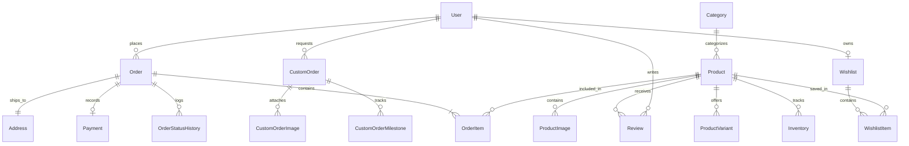

# Claypresso Database Schema & Entity Relationship

Claypresso uses [Prisma ORM](https://www.prisma.io/) configured in `prisma/schema.prisma`. 

The schema is configured for **SQLite** during local development (zero external services needed) and seamlessly supports **PostgreSQL** in cloud production deployments.

---

## Entity Relationship Overview



---

## Data Models

### 1. User (`User`)
Represents customer and admin accounts.
- `id`: CUID primary key
- `email`: Unique email string
- `passwordHash`: Bcrypt-hashed password
- `role`: Role enum string (`CUSTOMER` or `ADMIN`)
- `name`: Full name
- `phone`: Optional contact phone number

### 2. Product Catalog (`Product`, `Category`, `ProductImage`, `ProductVariant`)
- `Product`: Base entity holding name, slug, description, price, originalPrice, productionType (`READY_MADE`, `MADE_TO_ORDER`, `CUSTOM`), material, stock count, and badges (`bestseller`, `new`).
- `Category`: Categorization (`charms`, `keychains`, `mini-phone-charms`, `magnets`, `trays`, `badges`, `hair-pins`).
- `ProductImage`: Ordered gallery image URLs.
- `ProductVariant`: Optional colorway / clasp hardware adjustments.

### 3. Order Management (`Order`, `OrderItem`, `Address`, `Payment`)
- `Order`: Central order entity holding orderNumber (`CLP-YYYY-XXXXX-SUFFIX`), status (`PENDING`, `PROCESSING`, `SHIPPED`, `DELIVERED`, `CANCELLED`), subtotal, discount, shipping fee, and courier info (`courier`, `trackingNumber`, `trackingUrl`).
- `OrderItem`: Snapshot of product details, variant name, purchased quantity, and unit price at time of order.
- `Address`: Shipping destination address enforcing domestic Indian pincode and state requirements.
- `Payment`: Financial transaction record storing gatewayOrderId, gatewayPaymentId, paymentMethod (`UPI`, `CARD`, `NETBANKING`, `COD`), and paymentStatus (`PENDING`, `PAID`, `FAILED`, `REFUNDED`).

### 4. Custom Commissions (`CustomOrder`, `CustomOrderImage`, `CustomOrderMilestone`)
- `CustomOrder`: Bespoke customer commissions with reference number (`CLP-CUST-XXXX`), status (`INQUIRY_RECEIVED`, `QUOTE_SENT`, `COMMISSION_ACTIVE`, `IN_PRODUCTION`, `COMPLETED`), custom requirements, agreed quote amount, and target delivery date.
- `CustomOrderImage`: Uploaded customer reference photos.
- `CustomOrderMilestone`: Craft tracking checkpoints (`SCULPTING`, `IN_KILN`, `GLAZING`, `PACKED`).

### 5. Community & Marketing (`Review`, `Discount`, `Wishlist`)
- `Review`: Customer reviews with rating (1-5 stars), text, and moderation status (`PENDING`, `APPROVED`, `REJECTED`).
- `Discount`: Coupon codes with discountType (`PERCENTAGE` or `FIXED`), discountValue, minimumOrderAmount, usageLimit, usageCount, and validUntil timestamp.
- `Wishlist` / `WishlistItem`: Saved items for authenticated customer accounts.

---

## Migrations & Database Management

```bash
# Push schema updates directly to database
npm run db:push

# Generate new Prisma Client types
npx prisma generate

# Open visual Prisma Studio database browser
npx prisma studio

# Seed or reset database with sample records
npm run db:seed
```
